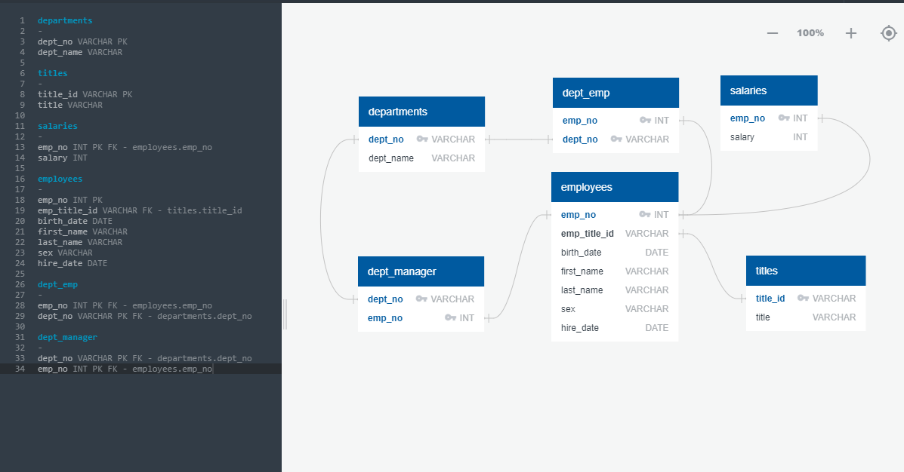
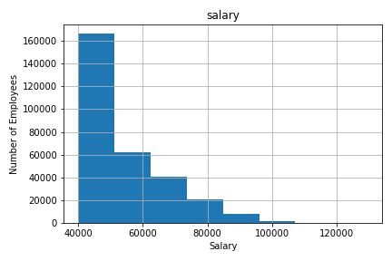
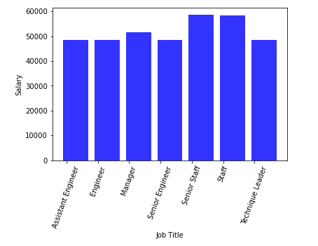

# Employee_Analysis_SQL

In this analaysis, I was given 6 CSV files to analyze. I created a schema using primary and foreign keys to reference each 
table against one another and found different metrics base off of speccified parameters. After creating a histogram and 
bar chart for employees salaries, the histogram showed expected pay grades based on the amount of employees in the company.

However, after observing the bar chart showing each department's respective average salary, I found that the assistant, mid-level,
and senior engineers were all being payed nearly the same amount on average. The same was true for the staff and senior staff which 
raised suspision. 

After approaching my superior about this, I searched my own employee number and found my name was catalogued as lady
named April Fools.
